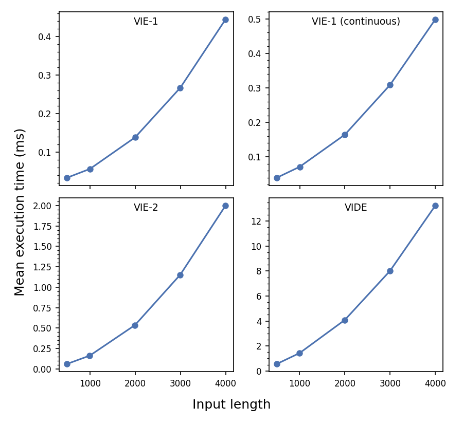
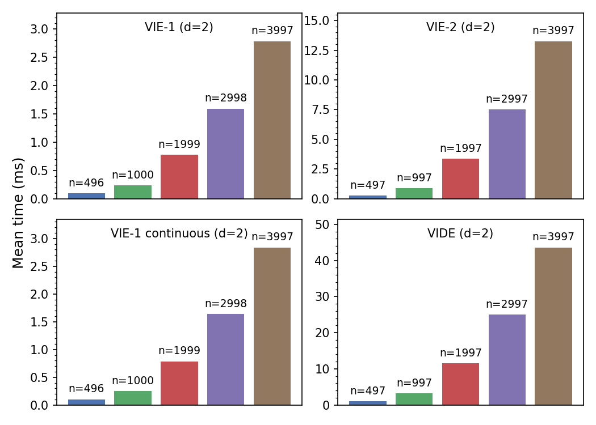

# volterra-equation-solvers

[](https://github.com/trout314/volterra-equation-solvers/actions/workflows/tests-linux.yml)
[](https://github.com/trout314/volterra-equation-solvers/actions/workflows/tests-macos.yml)
[](https://github.com/trout314/volterra-equation-solvers/actions/workflows/tests-windows.yml)
[](https://www.gnu.org/licenses/gpl-3.0)
[](https://www.python.org)

Collocation-method solvers for Volterra integral and integro-differential equations, based on:

> Brunner H. *Collocation Methods for Volterra Integral and Related Functional Differential Equations.* Cambridge University Press; 2004.

The solvers are implemented as a compiled extension written in the [D language](https://dlang.org) for maximum performance.

## Solvers

### `solve_VIE_1`

Given functions $K$ and $g$, solves for $y(t)$ in the Type-1 Volterra integral equation (VIE-1):

$$g(t) = \int_0^t K(t-s)\\, y(s)\\, ds$$

The solver handles the following cases:
- All functions are scalar-valued.
- $y(t)$ and $g(t)$ are $d$-dimensional vectors and $K(t)$ is a $d \times d$ matrix.
- $y(t)$ and $g(t)$ are $d \times m$ matrices and $K(t)$ is a $d \times d$ matrix.

### `solve_VIE_2`

Given functions $K$ and $g$, solves for $y(t)$ in the Type-2 Volterra integral equation (VIE-2):

$$y(t) = g(t) + \int_0^t K(t-s)\\, y(s)\\, ds$$

The solver handles the following cases:
- All functions are scalar-valued.
- $y(t)$ and $g(t)$ are $d$-dimensional vectors and $K(t)$ is a $d \times d$ matrix.
- $y(t)$ and $g(t)$ are $d \times m$ matrices and $K(t)$ is a $d \times d$ matrix.

### `solve_VIDE`

Given functions $K$, $a$, and $g$ and an initial value $y(0)$, solves for $y(t)$ in the Volterra integro-differential equation (VIDE):

$$y'(t) = a(t)\\, y(t) + g(t) + \int_0^t K(t-s)\\, y(s)\\, ds$$

The solver handles the following cases:
- All functions are scalar-valued.
- $y(t)$ and $g(t)$ are $d$-dimensional vectors and $K(t)$ and $a(t)$ are $d \times d$ matrices.
- $y(t)$ and $g(t)$ are $d \times m$ matrices and $K(t)$ and $a(t)$ are $d \times d$ matrices.

### `solve_VIE_1_trapz`, `solve_VIE_2_trapz` *(legacy)*

Lower-order trapezoidal-rule solvers for VIE-1 and VIE-2. Retained for backward compatibility; the collocation solvers above are preferred for new code.

## Installation

```bash
pip install volterra-equation-solvers
```

Pre-built wheels are provided for Linux x86_64, macOS (arm64 and x86_64), and Windows x64. The D extension is bundled in the wheel and requires no extra tooling.

**Requirements:** Python ≥ 3.10, numpy
**Optional:** numba, scipy
(only needed for non-standard collocation settings not supported by the D extension)

To build from source (e.g. on an unsupported platform), see [CONTRIBUTING.md](CONTRIBUTING.md).

## Quick start

```python
import numpy as np
from volterra_equation_solvers import solve_VIE_2

# y(t) = sin(t) satisfies this VIE-2 with K(s) = exp(-s)
time_step = 0.05
times = np.arange(0, 2.05, time_step)          # 41 pts = 10×2² + 1
kernel = np.exp(-times)
g = np.sin(times) - 0.5*(np.exp(-times) + np.sin(times) - np.cos(times))

soln = solve_VIE_2(
    kernel_values=kernel,
    g_values=g,
    time_step=time_step,
)
print(f"Max error: {max(abs(soln - np.sin(times))):.2e}")
```

All solvers accept `return_polys=True` to also return the piecewise polynomial solution as a list of `numpy.polynomial.Polynomial` objects.

## Vector and Matrix Valued Equations

`solve_VIE_1`, `solve_VIE_2`, and `solve_VIDE` also solve for vector-valued unknowns $\mathbf{y}(t) \in \mathbb{R}^d$, where the kernel $K$ and coefficient $a$ become $d \times d$ matrix-valued functions:

$$\mathbf{g}(t) = \int_0^t K(t-s)\\,\mathbf{y}(s)\\,ds$$

Pass `kernel_values` as an `(N, d, d)` array and `g_values` as an `(N, d)` array:

```python
import numpy as np
from volterra_equation_solvers import solve_VIE_1

# 2×2 VIE-1 with constant kernel K = [[3/2, -1/2], [-1/2, 3/2]],
# g(t) = [t + (3/2)t², t - (1/2)t²], and exact solution y(t) = [1+2t, 1]
time_step = 0.1
times = np.arange(0, 9.1, time_step)   # 91 pts = 10×3² + 1
N = len(times)

kernel = np.full((N, 2, 2), [[1.5, -0.5], [-0.5, 1.5]])

g = np.zeros((N, 2))
g[:, 0] = times + 1.5 * times**2
g[:, 1] = times - 0.5 * times**2

soln = solve_VIE_1(kernel_values=kernel, g_values=g, time_step=time_step)
# soln shape: (N, 2)
exact = np.column_stack([1 + 2*times, np.ones(N)])
print(f"Max error: {np.max(np.abs(soln - exact)):.2e}")
```

## Benchmarks

Run on a **GitHub Actions `ubuntu-22.04` runner** (2-core x86_64 VM on an Intel Xeon 8370C, 2.8 GHz base / 3.5 GHz boost). Mean time is averaged over a variable number of calibrated rounds (from ~9 for large inputs up to ~6000 for small inputs).



**Vector solvers** (D extension, d=2):



## Input format

- `kernel_values`: array of `K(s)` values from `s=0`, spaced by `time_step`
- Length must be `(multiple of coll_divs²) + 1`; longer arrays are truncated with a warning
- `coll_divs`: number of collocation sub-intervals (default varies by solver)
- `coll_choices`: list of integers selecting collocation nodes within each sub-interval

See the [Getting Started](docs/getting_started.md) page or the `notebooks/` directory for complete examples.

Worked derivations of the analytic solutions used in the test suite are in [`docs/scalar_solutions.pdf`](docs/scalar_solutions.pdf) and [`docs/coupled_vector_solutions.pdf`](docs/coupled_vector_solutions.pdf).
