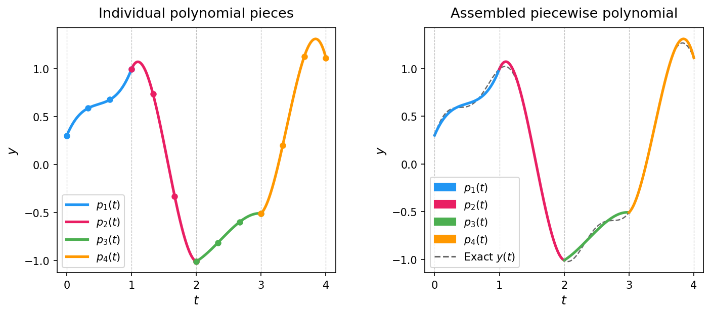

# voles

[](https://github.com/trout314/voles/actions/workflows/tests-linux.yml)
[](https://github.com/trout314/voles/actions/workflows/tests-macos.yml)
[](https://github.com/trout314/voles/actions/workflows/tests-windows.yml)
[](https://www.gnu.org/licenses/gpl-3.0)
[](https://www.python.org)
[](https://trout314.github.io/voles/)

<p align="center">
  
</p>

The Volterra Equation Solvers (VOLES) package is a collection of collocation-method solvers for Volterra integral and integro-differential equations. The algorithms used come from the book

> Brunner H. *Collocation Methods for Volterra Integral and Related Functional Differential Equations.* Cambridge University Press; 2004.

The solvers are implemented as a compiled extension written in the [D language](https://dlang.org). Performance should be on par with optimized C or FORTRAN code. All solvers support real-valued and complex-valued data, and scalar-, vector-, and matrix-valued equations. Currently, only convolution type kernels are supported, but this restriction is likely to be lifted in a future versions.

## Solvers

Two solver families are provided.

- The **array-input** family (`solve_VIE_1`, `solve_VIE_2`, `solve_VIDE`) take the kernel and other input functions as arrays of values given on a uniform time grid. They do not support singular kernels.

- The **callable-input** family (`function_solve_VIE_1`, `function_solve_VIE_2`, `function_solve_VIDE`) accept the kernel and other input functions as Python callables, and allow arbitrary collocation mesh intervals. These solvers support kernels with one or more integrable singularities, but the user must specify the location of the singular points. A helper function `optimal_graded_mesh` is provided for building an optimal set of mesh points in the case of a convolution kernel with a known power-law singularity at time zero. Note that the callable-input family of solvers require the package `scipy`, which is included by default.

### Type-1 Volterra integral equation (VIE-1)

Given $K$ and $g$, solve for $y(t)$ in:

$$g(t) = \int_0^t K(t-s)\\, y(s)\\, ds$$

| Solver | Inputs | Reference |
|---|---|---|
| `solve_VIE_1` | sampled arrays, uniform grid | [api/vie1/](https://trout314.github.io/voles/api/vie1/) |
| `function_solve_VIE_1` | callables, arbitrary mesh | [api/function_vie1/](https://trout314.github.io/voles/api/function_vie1/) |

### Type-2 Volterra integral equation (VIE-2)

Given $K$ and $g$, solve for $y(t)$ in:

$$y(t) = g(t) + \int_0^t K(t-s)\\, y(s)\\, ds$$

| Solver | Inputs | Reference |
|---|---|---|
| `solve_VIE_2` | sampled arrays, uniform grid | [api/vie2/](https://trout314.github.io/voles/api/vie2/) |
| `function_solve_VIE_2` | callables, arbitrary mesh | [api/function_vie2/](https://trout314.github.io/voles/api/function_vie2/) |

### Volterra integro-differential equation (VIDE)

Given $K$, $a$, $g$, and initial value $y(0)$, solve for $y(t)$ in:

$$y'(t) = a(t)\\, y(t) + g(t) + \int_0^t K(t-s)\\, y(s)\\, ds$$

| Solver | Inputs | Reference |
|---|---|---|
| `solve_VIDE` | sampled arrays, uniform grid | [api/vide/](https://trout314.github.io/voles/api/vide/) |
| `function_solve_VIDE` | callables, arbitrary mesh | [api/function_vide/](https://trout314.github.io/voles/api/function_vide/) |

### Mesh helper: `optimal_graded_mesh`

Returns a Brunner-graded mesh $t_n = T \,(n/M)^r$ with grading exponent $r = p / (1 - \alpha)$, where $p$ is the method order given by the paramerer `order`. To get an optimal mesh for a given set of collocation parameters, one should set `order=len(coll_choices)`. These meshes are designed for weakly singular convolution kernels $K(u) \sim u^{-\alpha}$ with $\alpha \in [0, 1)$. (For $\alpha = 0$ it returns a uniform mesh). Feeding the result to a callable-input solver via `mesh_breakpoints` gives optimal convergence in such situations.

API reference: [api/optimal_graded_mesh/](https://trout314.github.io/voles/api/optimal_graded_mesh/)

## Installation

```bash
pip install voles[full]
```

This gives you the fully-capable package, so everything just works out of the box. Pre-built wheels are provided for Linux x86_64, macOS arm64 (Apple Silicon), and Windows x64. The D extension is bundled in the wheel and requires no extra tooling. Intel Macs are no longer supported as of 0.3.2; users can pin to `volterra-equation-solvers==0.3.1` or build from source (see CONTRIBUTING.md).

**Requirements:** Python ≥ 3.10, numpy, scipy

**If you have trouble installing a dependency**, you can use a slimmer install instead. `numba` and `scipy` are only needed for some features (see below), so any of these will still give you a working package:

```bash
pip install voles          # core: numpy + scipy (no numba)
pip install voles --no-deps && pip install numpy   # leanest: numpy only, no scipy or numba
```

**What the optional pieces buy you:**
- `scipy` (core dependency) — required for the callable-input `function_solve_*` family.
- `numba` (added by `[full]`) — only needed for the array-based solvers when using non-standard collocation settings not compiled into the D extension.

To build from source (e.g. on an unsupported platform), see [CONTRIBUTING.md](CONTRIBUTING.md).

## Quick start

```python
import numpy as np
from voles import solve_VIE_2

# y(t) = sin(t) satisfies this VIE-2 with K(s) = exp(-s)
time_step = 0.05
times = np.arange(0, 2.1, time_step)   # 42 points
kernel = np.exp(-times)
g = np.sin(times) - 0.5*(np.exp(-times) + np.sin(times) - np.cos(times))

# Default solver settings require length of form 4k+1; input will be
# truncated from 42 to 41, so soln has 41 elements, not 42.
soln = solve_VIE_2(
    kernel_values=kernel,
    g_values=g,
    time_step=time_step,
)
print(f"Max error: {max(abs(soln - np.sin(times[:len(soln)]))):.2e}")
```

All solvers accept `return_function=True` to also return a callable solution object (`return_polys=True` is a deprecated alias). The object evaluates the piecewise polynomial solution at any time and also indexes/iterates like a list of `numpy.polynomial.Polynomial` objects.

The solvers require input arrays to satisfy an internal size constraint. Any length can be passed; if the length doesn't meet the constraint, the arrays are automatically truncated to the nearest valid length and a warning is printed. See the API reference for each solver for details.

## Vector and Matrix Valued Equations

All solvers can solve for vector-valued and matrix-valued functions $y(t)$. When $y(t)$ is a $d$-dimensional vector, $g(t)$ is also a $d$-dimensional vector and $K(t)$ and $a(t)$ are $d \times d$ matrices. When $y(t)$ is a $d \times m$ matrix, $g(t)$ is also a $d \times m$ matrix and $K(t)$ and $a(t)$ are $d \times d$ matrices. The case is detected automatically: for the array-based family from the shapes of the input arrays, and for the callable family from the shape returned by `g(t)` (a `(d, m)` return — or a `(d, m)` `soln_init_value` for VIDE — selects the matrix case). The callable family builds the kernel weight tensor once and shares it across the $m$ columns, so a matrix solve is much cheaper than $m$ separate calls; see the [callable-solver examples](https://trout314.github.io/voles/examples/function_solvers/) for a worked case.

```python
import numpy as np
from voles import solve_VIE_1

# 2×2 VIE-1 with constant kernel K = [[3/2, -1/2], [-1/2, 3/2]],
# g(t) = [t + (3/2)t², t - (1/2)t²], and exact solution y(t) = [1+2t, 1]
time_step = 0.1
times = np.arange(0, 9.1, time_step)   # 91 pts = 10×3² + 1
N = len(times)

kernel = np.full((N, 2, 2), [[1.5, -0.5], [-0.5, 1.5]])

g = np.zeros((N, 2))
g[:, 0] = times + 1.5 * times**2
g[:, 1] = times - 0.5 * times**2

soln = solve_VIE_1(kernel_values=kernel, g_values=g, time_step=time_step)
# soln shape: (N, 2)
exact = np.column_stack([1 + 2*times, np.ones(N)])
print(f"Max error: {np.max(np.abs(soln - exact)):.2e}")
```

## Complex-Valued Equations

All three solvers accept complex-valued inputs. Pass complex NumPy arrays for the kernel, forcing function, and (for VIDE) initial value, and the solver returns a complex-valued solution. This works for scalar, vector, and matrix cases alike.

```python
import numpy as np
from voles import solve_VIE_2

time_step = 0.05
times = np.arange(0, 2.1, time_step)
kernel = np.exp(-1j * times)               # complex kernel
g = np.ones_like(times, dtype=complex)

soln = solve_VIE_2(kernel_values=kernel, g_values=g, time_step=time_step)
# soln is a complex-valued array
```

## How the Collocation Method Works

The solvers approximate each component of $y(t)$ as a piecewise polynomial. The time axis is divided into mesh intervals, and on each interval the solution is represented by a polynomial whose coefficients are determined by requiring the Volterra equation to hold exactly at a set of collocation points within that interval.

Because the solution on each mesh interval is an explicit polynomial, the solver can optionally return it (see Polynomial Solutions below). This is useful for evaluating the solution at arbitrary times, differentiating, integrating, and so on.

## Piecewise Polynomial Illustration

The figure below shows an actual `voles` solution to a first-kind VIE ($g(t) = \sin t$, $K(s) = e^{s}$, exact solution $y(t) = \cos t - \sin t$). The time axis is split into mesh intervals at breakpoints $t_0, \ldots, t_4$ (dashed vertical lines); on each interval the solver finds a polynomial $p_i(t)$ that satisfies the equation at a set of collocation points (dots). A deliberately coarse mesh is used so the structure is visible: the pieces are **discontinuous across interval boundaries** — first-kind collocation does not enforce continuity by default — and visibly deviate from the exact solution (dashed). Refining the mesh shrinks both the jumps and the error.



## Polynomial Solutions

Passing `return_function=True` to any solver returns a `(soln_values, solution)` tuple (`return_polys=True` is a deprecated alias). `solution(t)` evaluates the piecewise polynomial at any time, and `solution` also indexes/iterates like a list of `numpy.polynomial.Polynomial` objects covering successive mesh intervals — these can be evaluated at any point, differentiated, integrated, and so on. The following example uses `solve_VIDE` to solve for $y(t) = \sin(t)$, then evaluates the solution and its derivative at a point not on the time grid:

```python
import numpy as np
from voles import solve_VIDE

# y(t) = sin(t) satisfies this VIDE with K(s) = exp(-s), a(t) = -1
time_step = 0.1
times = np.arange(0, 9.1, time_step)   # 91 points
kernel = np.exp(-times)
a = np.full(len(times), -1.0)
g = 1.5*np.cos(times) + 0.5*np.sin(times) - 0.5*np.exp(-times)

soln_vals, solution = solve_VIDE(
    kernel_values=kernel,
    a_values=a,
    g_values=g,
    soln_init_value=0.0,
    time_step=time_step,
    return_function=True,
)

# solution(t) evaluates the piecewise polynomial directly:
print(f"y(0.2)  ≈ {solution(0.2):.6f},  exact = {np.sin(0.2):.6f}")

# solution also indexes like the per-interval polynomials:
p = solution[0]                         # numpy.polynomial.Polynomial on t ∈ [0, 0.4]

# Differentiate to recover y'(t):
print(f"y'(0.2) ≈ {p.deriv()(0.2):.6f},  exact = {np.cos(0.2):.6f}")
```

## Benchmarks

All three solvers have the same expected asymptotic complexity in N, d, and m, where N is the number of input points, d is the number of rows in the solution, and m is the number of columns:

| | Scalar | Vector (d×1) | Matrix (d×m)* |
|---|---|---|---|
| Time | O(N²) | O(N²d²) | O(N²d²m) |
| Memory | O(N) | O(Nd²) | O(Nd²m) |

\* The m columns of the solution are independent and the code runs them in parallel.

The quadratic time scaling arises because each new mesh step requires a history sum over all previous steps. The `coll_divs` and `coll_choices` parameters affect the constant factor but not the asymptotic scaling in N, d, and m.

Mean wall-clock execution time in milliseconds for the **array-based** solvers, by input length $N$ (number of sampled points):

<!-- BENCHMARKS:START -->
| Solver \ N | 500 | 1000 | 2000 | 4000 | 8000 |
|---|---|---|---|---|---|
<<<<<<< Updated upstream
| VIE-1 | 0.03 | 0.06 | 0.15 | 0.48 | 1.82 |
| VIE-1 (continuous) | 0.04 | 0.07 | 0.17 | 0.53 | 1.94 |
| VIE-2 | 0.06 | 0.17 | 0.60 | 2.27 | 8.85 |
| VIDE | 0.59 | 1.47 | 4.14 | 13.1 | 46.3 |
| VIE-1 (d=2) | 0.09 | 0.23 | 0.77 | 2.88 | 11.2 |
| VIE-1 (d=2, continuous) | 0.10 | 0.24 | 0.80 | 2.93 | 11.1 |
| VIE-2 (d=2) | 0.24 | 0.84 | 3.21 | 12.7 | 50.1 |
| VIDE (d=2) | 1.04 | 3.39 | 12.2 | 45.9 | 178 |
=======
| VIE-1 | 0.04 | 0.06 | 0.14 | 0.46 | 1.71 |
| VIE-1 (continuous) | 0.05 | 0.08 | 0.17 | 0.51 | 1.76 |
| VIE-2 | 0.07 | 0.16 | 0.54 | 2.05 | 8.14 |
| VIDE | 0.59 | 1.45 | 4.15 | 13.6 | 47.5 |
| VIE-1 (d=2) | 0.10 | 0.24 | 0.77 | 2.82 | 10.8 |
| VIE-1 (d=2, continuous) | 0.11 | 0.26 | 0.82 | 2.86 | 10.9 |
| VIE-2 (d=2) | 0.26 | 0.90 | 3.40 | 13.3 | 52.9 |
| VIDE (d=2) | 0.99 | 3.23 | 11.6 | 43.8 | 171 |
>>>>>>> Stashed changes
<!-- BENCHMARKS:END -->

The **callable-input** solvers run the general path (Python + adaptive quadrature, no Toeplitz reuse), so they are benchmarked on much smaller problems, sized by the number of mesh intervals $M$ (each carrying `len(coll_choices)` collocation nodes). The *weakly singular* row uses an Abel kernel $K(u) = u^{-1/2}$ on a graded mesh with the singularity declared:

<!-- CALLABLE_BENCHMARKS:START -->
| Solver \ M | 25 | 50 | 100 |
|---|---|---|---|
<<<<<<< Updated upstream
| function_solve_VIE_1 | 21.8 | 83.1 | 328 |
| function_solve_VIE_2 | 22.1 | 86.4 | 344 |
| function_solve_VIE_2 (vector, d=3) | 45.6 | 179 | 711 |
| function_solve_VIDE | 22.6 | 87.2 | 344 |
| function_solve_VIE_2 (weakly singular) | 152 | 369 | 995 |
=======
| function_solve_VIE_1 | 16.5 | 58.8 | 224 |
| function_solve_VIE_2 | 16.5 | 59.4 | 234 |
| function_solve_VIE_2 (vector, d=3) | 27.3 | 101 | 394 |
| function_solve_VIDE | 16.4 | 59.4 | 231 |
| function_solve_VIE_2 (weakly singular) | 165 | 382 | 959 |
>>>>>>> Stashed changes
<!-- CALLABLE_BENCHMARKS:END -->

Run on a GitHub Actions `ubuntu-22.04` runner (2-core x86_64 VM on an Intel Xeon 8370C, 2.8 GHz base / 3.5 GHz boost). Mean time is averaged over a variable number of calibrated rounds (from ~9 for large inputs up to ~6000 for small inputs).

See the [Getting Started](https://trout314.github.io/voles/getting_started/) page for complete examples.

Worked derivations of the analytic solutions used in the test suite are in [`docs/scalar_solutions.pdf`](docs/scalar_solutions.pdf) and [`docs/coupled_vector_solutions.pdf`](docs/coupled_vector_solutions.pdf).
